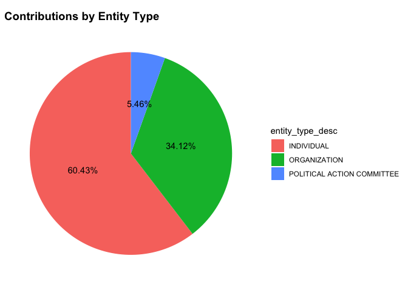
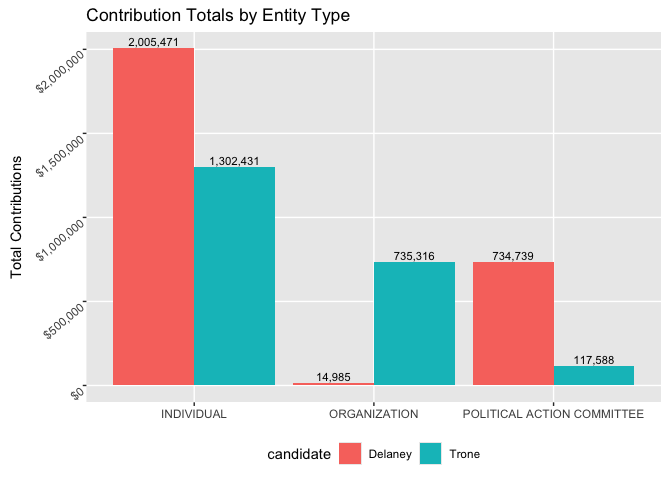

Exploratory Analysis
================

# Introduction:

My main goal for this project is to examine campaign contributions for
the two front runners in Maryland’s 6th congressional district race
later this year. My claim is that understanding where political
candidates receive their funding can help voters better evaluate an
important aspect of the election. For example, if a candidate promotes
clean energy but receives substantial financial support from oil
companies, voters should be aware of that discrepancy. Additionally,
small individual donations represent people who want to support a
candidate for any number of reasons. Sizable donations from PACs or
organizations represent groups with a vested interest in getting the
candidate elected to further their agenda. A candidate’s funding sources
say a lot about who they may ultimately serve.

## Become acquainted with your data sources:

- **Where did you find them?**

  - I sourced all of my data from <https://www.fec.gov>. This is the
    Federal Elections Commission where candidates have to report
    financial contributions to their election campaigns.

- **Who collected/maintains them?**

  - The Federal Elections Commission receives financial reports from
    people running for office. From their
    [website](https://www.fec.gov/about/mission-and-history/), “The
    Federal Election Commission (FEC) is the independent regulatory
    agency charged with administering and enforcing the federal campaign
    finance law. The FEC has jurisdiction over the financing of
    campaigns for the U.S. House, Senate, Presidency and the Vice
    Presidency.”

- **When and why were they originally collected?**

  - The data is being collected and maintained in real time. The data is
    collected to audit where people running for office are getting their
    financial support. The data is also collected to provide the public
    information about candidates and their finances.

- **What does a case represent in each data source, and how many total
  cases are available?**

  - A case in the data represents a single donation made by an
    organization or individual.

``` r
delaney_data %>% 
  summarise(nrows = n()) %>% 
  pull(nrows)
```

    ## [1] 3254

``` r
trone_data %>% 
  summarise(nrows = n()) %>% 
  pull(nrows)
```

    ## [1] 3402

``` r
all_data %>% 
  summarise(nrows = n()) %>% 
  pull(nrows)
```

    ## [1] 6656

A preliminary look at the data show that both Trone and Delaney have
relatively similar campaign contributions over their political career.
Trone has received 3402 donations over his political career and Delaney
has received 3254 donations over her political career. In total both
candidates (represented in the `all_data` data frame) have received 6656
donations.

- **What are some of the variables that you plan to use?**
  - I plan to base most of my analysis on who is donating and the
    distribution of donations across donor types. Because of this, I’ll
    be making some summary variables to calculate total donations by
    donor type, and then the proportion to the whole of the various
    donations.
  - Because I’ll be doing similar analysis on both data sets, I am
    writing functions to cut down on the duplicate effort:

``` r
summarize_finances <- function(df) {
  df_filtered(df) %>% # apply the filter first
    group_by(entity_type_desc) %>%
    summarise(total = sum(contribution_receipt_amount, na.rm = TRUE), .groups = "drop") %>%
    mutate(prop = round((total / sum(total))*100, 2)) %>%
    arrange(desc(total))
}
```

From there, I’ll apply the data set to the function.

``` r
trone_fin_dist <- summarize_finances(trone_data) %>% mutate(candidate = "Trone")
trone_fin_dist
```

    ## # A tibble: 3 × 4
    ##   entity_type_desc              total  prop candidate
    ##   <chr>                         <dbl> <dbl> <chr>    
    ## 1 INDIVIDUAL                 1302431. 60.4  Trone    
    ## 2 ORGANIZATION                735316. 34.1  Trone    
    ## 3 POLITICAL ACTION COMMITTEE  117588.  5.46 Trone

An informative plot for the above data may be a [simple
piechart](https://www.sthda.com/english/wiki/ggplot2-pie-chart-quick-start-guide-r-software-and-data-visualization#google_vignette)
to visualize distribution:

``` r
blank_theme <- theme_minimal()+
  theme(
  axis.title.x = element_blank(),
  axis.title.y = element_blank(),
  axis.text.x = element_blank(),
  axis.text.y = element_blank(), 
  panel.border = element_blank(),
  panel.grid=element_blank(),
  axis.ticks = element_blank(),
  plot.title=element_text(size=14, face="bold")
  )

bp <- ggplot(trone_fin_dist, aes(x="", y= total, fill= entity_type_desc))+
geom_bar(width = 1, stat = "identity") +
geom_text(aes(label = paste0(prop, "%")),
          position = position_stack(vjust = 0.5)) +
  labs(title = "Contributions by Entity Type")

pie <- bp + blank_theme + coord_polar("y", start=0)
pie
```

<!-- -->

``` r
trone_donor_dist
```

    ## # A tibble: 10 × 3
    ##    contributor_name                               total candidate
    ##    <chr>                                          <dbl> <chr>    
    ##  1 CANAL PARTNERS MEDIA                         599642. Trone    
    ##  2 AMERICAN ISRAEL PUBLIC AFFAIRS COMMITTEE PAC 105600  Trone    
    ##  3 NAI THE MICHAEL COMPANIES, INC                41795. Trone    
    ##  4 GMMB                                          30435. Trone    
    ##  5 PAYCHEX                                       21920. Trone    
    ##  6 OZMEN, FATIH                                  15200  Trone    
    ##  7 ETHOS ORGANIZING                              15000  Trone    
    ##  8 CRISSES, ANDREW                               13000  Trone    
    ##  9 RUBIN, PAMELA                                 12800  Trone    
    ## 10 RUBIN, RONALD                                 12800  Trone

``` r
delaney_donor_dist
```

    ## # A tibble: 10 × 3
    ##    contributor_name                                              total candidate
    ##    <chr>                                                         <dbl> <chr>    
    ##  1 AMERICAN ISRAEL PUBLIC AFFAIRS COMMITTEE POLITICAL ACTION C… 100150 Delaney  
    ##  2 DEMOCRACY SUMMER 2026                                         40750 Delaney  
    ##  3 LENNON, DANIEL                                                20400 Delaney  
    ##  4 NEW DEMOCRAT COALITION ACTION FUND                            20300 Delaney  
    ##  5 CLARE, TERESA                                                 20200 Delaney  
    ##  6 AMERIPAC: THE FUND FOR A GREATER AMERICA                      19900 Delaney  
    ##  7 ELECT DEMOCRATIC WOMEN                                        18500 Delaney  
    ##  8 AMERICAN FEDERATION OF STATE COUNTY & MUNICIPAL EMPLOYEES  …  15000 Delaney  
    ##  9 JOBS, EDUCATION, & FAMILIES FIRST  JEFF PAC                   15000 Delaney  
    ## 10 KARAM, MICHAEL                                                14900 Delaney

## Explore intuition related to the research question:

My first intuition is that each candidate will have received a
considerable amount of money from PACs and organizations. I can’t say
how much they each have received form individual donations, but I’d
venture to guess that both candidates have similar distributions of
donors. It is widely accepted that a small individual donation is less
than 200 dollars and comes from from an actual person.

``` r
# Campaign Contribution by Entity Type ------------------------------------
ggplot(all_dist) + 
  aes(x = entity_type_desc, y = total, fill = candidate) +
  geom_col(position = "dodge", stat = "identity") +
  
  geom_text(
    aes(label = scales::comma(total)),
    position = position_dodge(width = 0.9),
    vjust = -0.3,
    size = 3
  ) +
  
  theme(
    panel.grid.minor = element_blank(),
    plot.margin = margin(6, 8, 6, 8),
    axis.text.y = element_text(angle = 40, hjust = 1, vjust = 1),
    legend.position = "bottom"
  ) +
  
  scale_y_continuous(labels = dollar) +
  
  labs(
    title = "Contribution Totals by Entity Type",
    x = NULL,
    y = "Total Contributions"
  )
```

<!-- -->

### Notes and Considerations

The data will need to be cleaned up a bit. There are many variables that
I don’t care about that add to the noise of the data sets. Also, there
are instances of repeated cases where one case will be referencing
another but will contain identical data. I also want to isolate money in
from outside sources. Both candidates have contributed to their own
campaign, which is apparently allowed. For example, Trone has given
himself a staggering 112 million dollars during his time as a
politician:

``` r
ind_cont <- trone_data %>% 
  filter(entity_type_desc == "CANDIDATE") %>% 
  summarise(total = sum(contribution_receipt_amount)) %>% 
  pull(total)
ind_cont
```

    ## [1] 114812304

Other cleaning will have to occur as well. The organization “Actblue”
seems to be a group that prominent democrat politicians work with to
generate donations. So each individual contribution will be duplicated
by the contribution made on behalf of the individual by Actblue, this is
confusing so I want to remove the organization completely. Because of
the various cleaning that is necessary, I’ve written the following
function:

``` r
df_filtered <- function(df) {
  df %>%
    filter(
      !entity_type_desc %in% c("CANDIDATE", "CAMPAIGN COMMITTEE", 
                               "POLITICAL PARTY COMMITTEE", "OTHER COMMITTEE"),
      contribution_receipt_amount > 0,
      report_year >= 2020,
      contributor_name != "ACTBLUE")
}
```

I want to remove campaign contributions made by the politician running
and take out negative amounts (reimbursements / refunds), filter the
2020 and beyond and as mentioned prior, remove Actblue (read:
duplicates).
