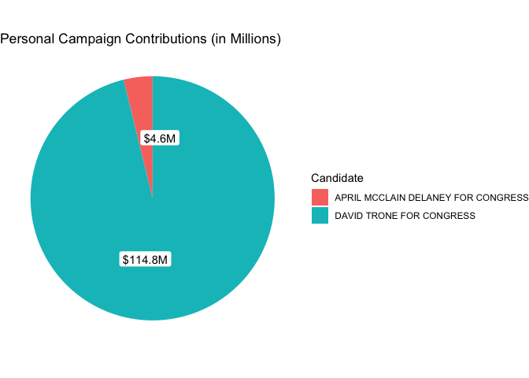
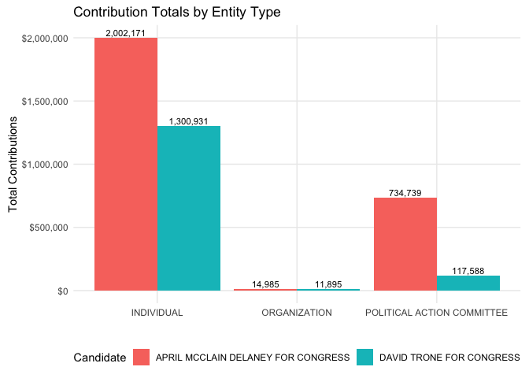
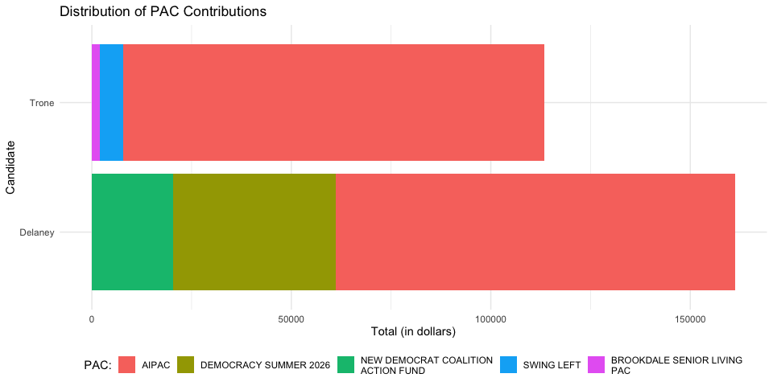
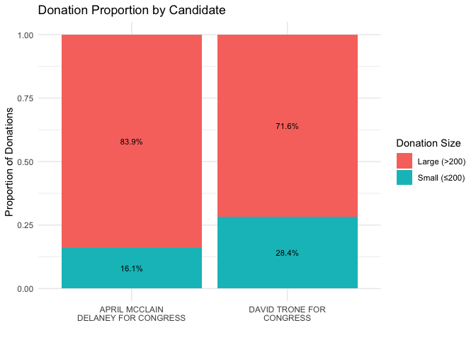
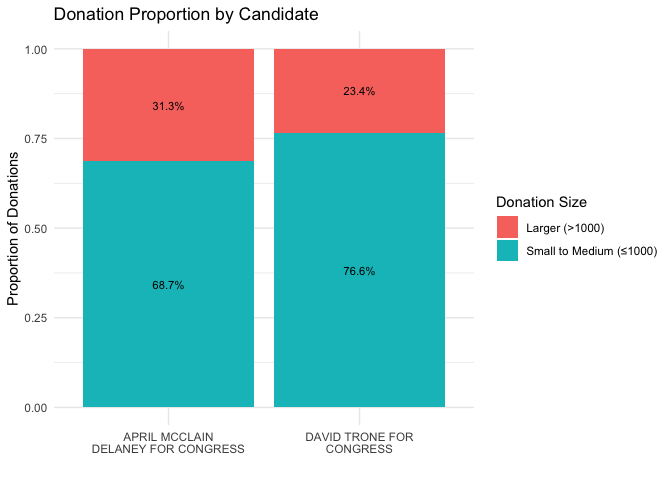
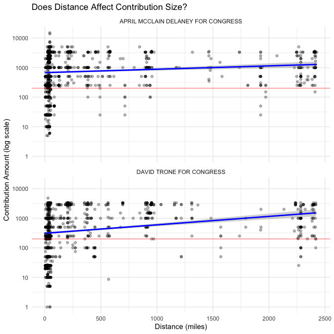
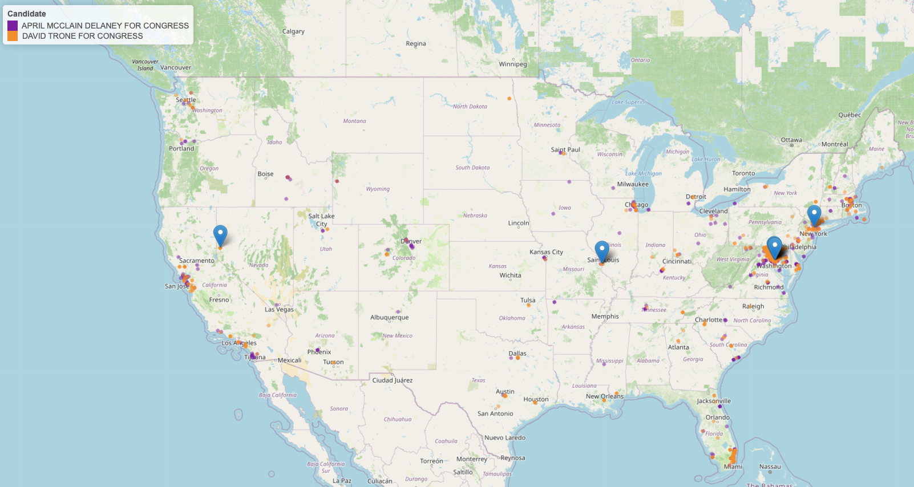

Final Project - GitHub Version
================
Ethan Miller
May 03, 2026

# Where Are My Representatives Getting Their Money?

No matter your politics, voting is an essential part of a democratic
society. It is our responsibility as individuals to participate in
elections to make our voices heard and ensure the needs of our community
are met. With this in mind, I decided to make my project about the
campaign finances of the two front runners for the upcoming
congressional election in Maryland’s 6th district.

The goal of this project is not to unpack the specific policies that
these candidates will be running on, but to analyze where their funding
is coming from that allows them to run for congress in the first place.
The two candidates I will be focusing on are the incumbent, April
McClain Delaney, and her opponent, David Trone. At its core, this
project asks a simple question: where does their money come from?

### Why Finances Matter

During election cycles, we’re inundated with ads, commercials, and
rallies outlining what candidates say they’ll do if elected. We hear
what they want to change and what they believe the current
representative has gotten wrong. That messaging is an important part of
any campaign, but it only tells part of the story.

None of these promises can happen without money. Campaigns are powered
by funding, and where that money comes from matters. Candidates may
self-finance, receive contributions from organizations or corporations,
accept support from Political Action Committees, or rely on individual
donors. Each of these sources, and the amounts they contribute, helps
tell a story about a campaign’s priorities, backing, and potential
influence.

### Where the Data Comes From

All the data that I have accumulated for this project comes from
[FEC.GOV](https://www.fec.gov). This website hosts the Federal Election
Commission, an “independent regulatory agency charged with administering
and enforcing the federal campaign finance law.” Part of this work
consists of aggregating campaign contribution data and making it
accessible to the public. This information is being updated in real
time, but I pulled data on March 17th 2026.

### What I Want to Learn

My goal is understanding the financial side of these campaigns. I want
to know how much each candidate contributes to their own campaign, who
their donors are, where those donors are located, and how much they
give. I’m also interested in the proportion of funding that comes from
different types of donors, as well as mapping where contributors live to
see whether out-of-state money plays a role.

### Summary

This project aims to answer a few key questions:

- How much of their campaign is each candidate self-funding?

- What proportion of funding comes from the different types of donors?

- Who is donating to each campaign?

- How much are they contributing?

- Where are these donors located?

## Preliminary Analysis:

Before I begin, I will import the data sets and inspect their various
elements:

``` r
# Load in Delaney data, glimpse at variable structure.
delaney_data <- read_csv(
  here("Campaign Donations", "MD", "Delaney", "schedule_a-2026-03-17T18_54_17.csv")
)
```

    ## Warning: One or more parsing issues, call `problems()` on your data frame for details,
    ## e.g.:
    ##   dat <- vroom(...)
    ##   problems(dat)

    ## Rows: 3254 Columns: 78
    ## ── Column specification ────────────────────────────────────────────────────────
    ## Delimiter: ","
    ## chr  (47): committee_id, committee_name, report_type, filing_form, line_numb...
    ## dbl  (11): report_year, image_number, link_id, transaction_id, file_number, ...
    ## lgl  (18): contributor_prefix, recipient_committee_org_type, contributor_suf...
    ## dttm  (2): contribution_receipt_date, load_date
    ## 
    ## ℹ Use `spec()` to retrieve the full column specification for this data.
    ## ℹ Specify the column types or set `show_col_types = FALSE` to quiet this message.

``` r
glimpse(delaney_data)
```

    ## Rows: 3,254
    ## Columns: 78
    ## $ committee_id                          <chr> "C00854471", "C00854471", "C0085…
    ## $ committee_name                        <chr> "APRIL MCCLAIN DELANEY FOR CONGR…
    ## $ report_year                           <dbl> 2024, 2024, 2024, 2024, 2024, 20…
    ## $ report_type                           <chr> "12P", "12P", "12G", "12G", "Q3"…
    ## $ image_number                          <dbl> 2.024063e+17, 2.024063e+17, 2.02…
    ## $ filing_form                           <chr> "F3", "F3", "F3", "F3", "F3", "F…
    ## $ link_id                               <dbl> 4.06292e+18, 4.06292e+18, 4.1205…
    ## $ line_number                           <chr> "11AI", "11AI", "11AI", "11AI", …
    ## $ transaction_id                        <dbl> 5847289, 5847288, 8168998, 81790…
    ## $ file_number                           <dbl> 1792699, 1792699, 1856230, 18562…
    ## $ entity_type                           <chr> "IND", "IND", "IND", "IND", "IND…
    ## $ entity_type_desc                      <chr> "INDIVIDUAL", "INDIVIDUAL", "IND…
    ## $ unused_contbr_id                      <chr> "C00401224", "C00401224", NA, NA…
    ## $ contributor_prefix                    <lgl> NA, NA, NA, NA, NA, NA, NA, NA, …
    ## $ contributor_name                      <chr> "CLARE, TERESA", "CLARE, TERESA"…
    ## $ recipient_committee_type              <chr> "H", "H", "H", "H", "H", "H", "H…
    ## $ recipient_committee_org_type          <lgl> NA, NA, NA, NA, NA, NA, NA, NA, …
    ## $ recipient_committee_designation       <chr> "P", "P", "P", "P", "P", "P", "P…
    ## $ contributor_first_name                <chr> "TERESA", "TERESA", "PHILIP", "P…
    ## $ contributor_middle_name               <chr> NA, NA, NA, NA, NA, NA, NA, NA, …
    ## $ contributor_last_name                 <chr> "CLARE", "CLARE", "INGLIMA", "CO…
    ## $ contributor_suffix                    <lgl> NA, NA, NA, NA, NA, NA, NA, NA, …
    ## $ contributor_street_1                  <chr> "4400 W ST NW", "4400 W ST NW", …
    ## $ contributor_street_2                  <chr> NA, NA, NA, NA, "STE 203", "APT …
    ## $ contributor_city                      <chr> "WASHINGTON", "WASHINGTON", "WAS…
    ## $ contributor_state                     <chr> "DC", "DC", "DC", "MD", "MD", "M…
    ## $ contributor_zip                       <chr> "200071100", "200071100", "20015…
    ## $ contributor_employer                  <chr> "GEORGETOWN UNIVERSITY", "GEORGE…
    ## $ contributor_occupation                <chr> "ADJUNCT PROFESSOR", "ADJUNCT PR…
    ## $ contributor_id                        <chr> "C00401224", "C00401224", NA, NA…
    ## $ is_individual                         <lgl> TRUE, TRUE, TRUE, TRUE, TRUE, TR…
    ## $ receipt_type                          <chr> "15E", "15E", "15", "15", "15", …
    ## $ receipt_type_desc                     <chr> "EARMARKED CONTRIBUTION", "EARMA…
    ## $ receipt_type_full                     <lgl> NA, NA, NA, NA, NA, NA, NA, NA, …
    ## $ memo_code                             <chr> "X", "X", "X", "X", "X", "X", "X…
    ## $ memo_code_full                        <lgl> NA, NA, NA, NA, NA, NA, NA, NA, …
    ## $ memo_text                             <chr> "* AMOUNT REATTRIBUTED TO SPOUSE…
    ## $ contribution_receipt_date             <dttm> 2024-04-08, 2024-04-08, 2024-10…
    ## $ contribution_receipt_amount           <dbl> -3300.00, -3300.00, -3000.00, -1…
    ## $ contributor_aggregate_ytd             <dbl> 6600.00, 6600.00, 5800.00, 3300.…
    ## $ candidate_id                          <chr> NA, NA, NA, NA, NA, NA, NA, NA, …
    ## $ candidate_name                        <chr> NA, NA, NA, NA, NA, NA, NA, NA, …
    ## $ candidate_first_name                  <chr> NA, NA, NA, NA, NA, NA, NA, NA, …
    ## $ candidate_last_name                   <chr> NA, NA, NA, NA, NA, NA, NA, NA, …
    ## $ candidate_middle_name                 <chr> NA, NA, NA, NA, NA, NA, NA, NA, …
    ## $ candidate_prefix                      <lgl> NA, NA, NA, NA, NA, NA, NA, NA, …
    ## $ candidate_suffix                      <lgl> NA, NA, NA, NA, NA, NA, NA, NA, …
    ## $ candidate_office                      <chr> NA, NA, NA, NA, NA, NA, NA, NA, …
    ## $ candidate_office_full                 <chr> NA, NA, NA, NA, NA, NA, NA, NA, …
    ## $ candidate_office_state                <chr> NA, NA, NA, NA, NA, NA, NA, NA, …
    ## $ candidate_office_state_full           <chr> NA, NA, NA, NA, NA, NA, NA, NA, …
    ## $ candidate_office_district             <chr> NA, NA, NA, NA, NA, NA, NA, NA, …
    ## $ conduit_committee_id                  <lgl> NA, NA, NA, NA, NA, NA, NA, NA, …
    ## $ conduit_committee_name                <lgl> NA, NA, NA, NA, NA, NA, NA, NA, …
    ## $ conduit_committee_street1             <lgl> NA, NA, NA, NA, NA, NA, NA, NA, …
    ## $ conduit_committee_street2             <lgl> NA, NA, NA, NA, NA, NA, NA, NA, …
    ## $ conduit_committee_city                <lgl> NA, NA, NA, NA, NA, NA, NA, NA, …
    ## $ conduit_committee_state               <lgl> NA, NA, NA, NA, NA, NA, NA, NA, …
    ## $ conduit_committee_zip                 <lgl> NA, NA, NA, NA, NA, NA, NA, NA, …
    ## $ donor_committee_name                  <chr> NA, NA, NA, NA, NA, NA, NA, NA, …
    ## $ national_committee_nonfederal_account <lgl> NA, NA, NA, NA, NA, NA, NA, NA, …
    ## $ election_type                         <chr> "G2024", "P2024", "G2024", "G202…
    ## $ election_type_full                    <chr> NA, NA, NA, NA, NA, NA, NA, NA, …
    ## $ fec_election_type_desc                <chr> "GENERAL", "PRIMARY", "GENERAL",…
    ## $ fec_election_year                     <dbl> 2024, 2024, 2024, 2024, 2024, 20…
    ## $ two_year_transaction_period           <dbl> 2024, 2024, 2024, 2024, 2024, 20…
    ## $ amendment_indicator                   <chr> "N", "N", "N", "N", "N", "N", "N…
    ## $ amendment_indicator_desc              <chr> "NO CHANGE", "NO CHANGE", "NO CH…
    ## $ schedule_type                         <chr> "SA", "SA", "SA", "SA", "SA", "S…
    ## $ schedule_type_full                    <chr> "ITEMIZED RECEIPTS", "ITEMIZED R…
    ## $ increased_limit                       <lgl> NA, NA, NA, NA, NA, NA, NA, NA, …
    ## $ load_date                             <dttm> 2024-06-30 04:06:16, 2024-06-30…
    ## $ sub_id                                <dbl> 4.06292e+18, 4.06292e+18, 4.0106…
    ## $ original_sub_id                       <lgl> NA, NA, NA, NA, NA, NA, NA, NA, …
    ## $ back_reference_transaction_id         <dbl> NA, NA, NA, NA, NA, NA, NA, 8151…
    ## $ back_reference_schedule_name          <chr> NA, NA, NA, NA, NA, NA, NA, "SA1…
    ## $ pdf_url                               <chr> "https://docquery.fec.gov/cgi-bi…
    ## $ line_number_label                     <chr> "Contributions From Individuals/…

``` r
# Pull summary data from donations variable.
summary(delaney_data$contribution_receipt_amount)
```

    ##    Min. 1st Qu.  Median    Mean 3rd Qu.    Max. 
    ##   -3500     250    1000    2764    2500  825000

``` r
# Examine first 10 rows of data.
head(delaney_data, 10)
```

    ## # A tibble: 10 × 78
    ##    committee_id committee_name  report_year report_type image_number filing_form
    ##    <chr>        <chr>                 <dbl> <chr>              <dbl> <chr>      
    ##  1 C00854471    APRIL MCCLAIN …        2024 12P              2.02e17 F3         
    ##  2 C00854471    APRIL MCCLAIN …        2024 12P              2.02e17 F3         
    ##  3 C00854471    APRIL MCCLAIN …        2024 12G              2.02e17 F3         
    ##  4 C00854471    APRIL MCCLAIN …        2024 12G              2.02e17 F3         
    ##  5 C00854471    APRIL MCCLAIN …        2024 Q3               2.02e17 F3         
    ##  6 C00854471    APRIL MCCLAIN …        2024 Q3               2.02e17 F3         
    ##  7 C00854471    APRIL MCCLAIN …        2024 Q3               2.02e17 F3         
    ##  8 C00854471    APRIL MCCLAIN …        2024 30G              2.02e17 F3         
    ##  9 C00854471    APRIL MCCLAIN …        2024 30G              2.02e17 F3         
    ## 10 C00854471    APRIL MCCLAIN …        2024 Q3               2.02e17 F3         
    ## # ℹ 72 more variables: link_id <dbl>, line_number <chr>, transaction_id <dbl>,
    ## #   file_number <dbl>, entity_type <chr>, entity_type_desc <chr>,
    ## #   unused_contbr_id <chr>, contributor_prefix <lgl>, contributor_name <chr>,
    ## #   recipient_committee_type <chr>, recipient_committee_org_type <lgl>,
    ## #   recipient_committee_designation <chr>, contributor_first_name <chr>,
    ## #   contributor_middle_name <chr>, contributor_last_name <chr>,
    ## #   contributor_suffix <lgl>, contributor_street_1 <chr>, …

``` r
# Load in Trone data, glimpse at variable structure.
trone_data_raw <- read_csv(
  here("Campaign Donations", "MD", "Trone", "schedule_a-2026-03-17T18_57_57.csv")
)
```

    ## Warning: One or more parsing issues, call `problems()` on your data frame for details,
    ## e.g.:
    ##   dat <- vroom(...)
    ##   problems(dat)

    ## Rows: 3402 Columns: 78
    ## ── Column specification ────────────────────────────────────────────────────────
    ## Delimiter: ","
    ## chr  (49): committee_id, committee_name, report_type, filing_form, line_numb...
    ## dbl   (9): report_year, image_number, link_id, file_number, contribution_rec...
    ## lgl  (18): contributor_prefix, recipient_committee_org_type, is_individual, ...
    ## dttm  (2): contribution_receipt_date, load_date
    ## 
    ## ℹ Use `spec()` to retrieve the full column specification for this data.
    ## ℹ Specify the column types or set `show_col_types = FALSE` to quiet this message.

``` r
glimpse(trone_data_raw)
```

    ## Rows: 3,402
    ## Columns: 78
    ## $ committee_id                          <chr> "C00653196", "C00653196", "C0065…
    ## $ committee_name                        <chr> "DAVID TRONE FOR CONGRESS", "DAV…
    ## $ report_year                           <dbl> 2022, 2020, 2020, 2019, 2019, 20…
    ## $ report_type                           <chr> "12G", "Q3", "Q3", "Q2", "YE", "…
    ## $ image_number                          <dbl> 2.022113e+17, 2.020102e+17, 2.02…
    ## $ filing_form                           <chr> "F3", "F3", "F3", "F3", "F3", "F…
    ## $ link_id                               <dbl> 4.11302e+18, 4.10162e+18, 4.1016…
    ## $ line_number                           <chr> "11AI", "11AI", "11AI", "11AI", …
    ## $ transaction_id                        <chr> "7147842", "2290263", "2290263E"…
    ## $ file_number                           <dbl> 1663379, 1449953, 1449953, 14377…
    ## $ entity_type                           <chr> "IND", "IND", "PAC", "IND", "IND…
    ## $ entity_type_desc                      <chr> "INDIVIDUAL", "INDIVIDUAL", "POL…
    ## $ unused_contbr_id                      <chr> "C00401224", NA, "C00401224", NA…
    ## $ contributor_prefix                    <lgl> NA, NA, NA, NA, NA, NA, NA, NA, …
    ## $ contributor_name                      <chr> "FEIGON, SHARON", "SCHIFTER, RCH…
    ## $ recipient_committee_type              <chr> "H", "H", "H", "H", "H", "H", "H…
    ## $ recipient_committee_org_type          <lgl> NA, NA, NA, NA, NA, NA, NA, NA, …
    ## $ recipient_committee_designation       <chr> "P", "P", "P", "P", "P", "P", "P…
    ## $ contributor_first_name                <chr> "SHARON", "RCHARD", NA, "ALAIN",…
    ## $ contributor_middle_name               <chr> NA, NA, NA, NA, NA, NA, NA, NA, …
    ## $ contributor_last_name                 <chr> "FEIGON", "SCHIFTER", NA, "BARBE…
    ## $ contributor_suffix                    <chr> NA, NA, NA, NA, NA, NA, NA, NA, …
    ## $ contributor_street_1                  <chr> "711 ROSLYN TER", "6907 CRAIL DR…
    ## $ contributor_street_2                  <chr> NA, NA, NA, NA, NA, NA, "UNIT 3B…
    ## $ contributor_city                      <chr> "EVANSTON", "BETHESDA", "WEST SO…
    ## $ contributor_state                     <chr> "IL", "MD", "MA", "NJ", "MD", "M…
    ## $ contributor_zip                       <chr> "602011721", "208174723", "02144…
    ## $ contributor_employer                  <chr> "SHARD USE MOBILITY CENTER", "NO…
    ## $ contributor_occupation                <chr> "EXECUTIVE DIRECTOR", "NOT EMPLO…
    ## $ contributor_id                        <chr> "C00401224", NA, "C00401224", NA…
    ## $ is_individual                         <lgl> TRUE, TRUE, FALSE, TRUE, TRUE, F…
    ## $ receipt_type                          <chr> "15E", NA, NA, "15", "15E", NA, …
    ## $ receipt_type_desc                     <chr> "EARMARKED CONTRIBUTION", NA, NA…
    ## $ receipt_type_full                     <lgl> NA, NA, NA, NA, NA, NA, NA, NA, …
    ## $ memo_code                             <chr> NA, NA, "X", NA, NA, "X", NA, "X…
    ## $ memo_code_full                        <lgl> NA, NA, NA, NA, NA, NA, NA, NA, …
    ## $ memo_text                             <chr> "* EARMARKED CONTRIBUTION: SEE B…
    ## $ contribution_receipt_date             <dttm> 2022-10-18, 2020-08-18, 2020-08…
    ## $ contribution_receipt_amount           <dbl> 8.62, 15.00, 15.00, 20.00, 25.00…
    ## $ contributor_aggregate_ytd             <dbl> 508.62, 15.00, 40709.90, 1020.00…
    ## $ candidate_id                          <chr> NA, NA, NA, NA, NA, NA, NA, NA, …
    ## $ candidate_name                        <chr> NA, NA, NA, NA, NA, NA, NA, NA, …
    ## $ candidate_first_name                  <chr> NA, NA, NA, NA, NA, NA, NA, NA, …
    ## $ candidate_last_name                   <chr> NA, NA, NA, NA, NA, NA, NA, NA, …
    ## $ candidate_middle_name                 <chr> NA, NA, NA, NA, NA, NA, NA, NA, …
    ## $ candidate_prefix                      <lgl> NA, NA, NA, NA, NA, NA, NA, NA, …
    ## $ candidate_suffix                      <lgl> NA, NA, NA, NA, NA, NA, NA, NA, …
    ## $ candidate_office                      <chr> NA, NA, NA, NA, NA, NA, NA, NA, …
    ## $ candidate_office_full                 <chr> NA, NA, NA, NA, NA, NA, NA, NA, …
    ## $ candidate_office_state                <chr> NA, NA, NA, NA, NA, NA, NA, NA, …
    ## $ candidate_office_state_full           <chr> NA, NA, NA, NA, NA, NA, NA, NA, …
    ## $ candidate_office_district             <chr> NA, NA, NA, NA, NA, NA, NA, NA, …
    ## $ conduit_committee_id                  <lgl> NA, NA, NA, NA, NA, NA, NA, NA, …
    ## $ conduit_committee_name                <lgl> NA, NA, NA, NA, NA, NA, NA, NA, …
    ## $ conduit_committee_street1             <lgl> NA, NA, NA, NA, NA, NA, NA, NA, …
    ## $ conduit_committee_street2             <lgl> NA, NA, NA, NA, NA, NA, NA, NA, …
    ## $ conduit_committee_city                <lgl> NA, NA, NA, NA, NA, NA, NA, NA, …
    ## $ conduit_committee_state               <lgl> NA, NA, NA, NA, NA, NA, NA, NA, …
    ## $ conduit_committee_zip                 <lgl> NA, NA, NA, NA, NA, NA, NA, NA, …
    ## $ donor_committee_name                  <chr> NA, NA, "ACTBLUE", NA, NA, "ACTB…
    ## $ national_committee_nonfederal_account <lgl> NA, NA, NA, NA, NA, NA, NA, NA, …
    ## $ election_type                         <chr> "G2022", "G2020", "G2020", "P202…
    ## $ election_type_full                    <lgl> NA, NA, NA, NA, NA, NA, NA, NA, …
    ## $ fec_election_type_desc                <chr> "GENERAL", "GENERAL", "GENERAL",…
    ## $ fec_election_year                     <dbl> 2022, 2020, 2020, 2020, 2020, 20…
    ## $ two_year_transaction_period           <dbl> 2022, 2020, 2020, 2020, 2020, 20…
    ## $ amendment_indicator                   <chr> "N", "A", "A", "A", "A", "A", "A…
    ## $ amendment_indicator_desc              <chr> "NO CHANGE", "ADD", "ADD", "ADD"…
    ## $ schedule_type                         <chr> "SA", "SA", "SA", "SA", "SA", "S…
    ## $ schedule_type_full                    <chr> "ITEMIZED RECEIPTS", "ITEMIZED R…
    ## $ increased_limit                       <lgl> NA, NA, NA, NA, NA, NA, NA, NA, …
    ## $ load_date                             <dttm> 2022-12-08 03:36:04, 2020-11-14…
    ## $ sub_id                                <dbl> 4.12072e+18, 4.11142e+18, 4.1114…
    ## $ original_sub_id                       <lgl> NA, NA, NA, NA, NA, NA, NA, NA, …
    ## $ back_reference_transaction_id         <chr> "7147842E", "2290263E", NA, NA, …
    ## $ back_reference_schedule_name          <chr> "SA11AI", "SA11AI", NA, NA, "SA1…
    ## $ pdf_url                               <chr> "https://docquery.fec.gov/cgi-bi…
    ## $ line_number_label                     <chr> "Contributions From Individuals/…

``` r
# Pull summary data from donations variable
summary(trone_data_raw$contribution_receipt_amount)
```

    ##     Min.  1st Qu.   Median     Mean  3rd Qu.     Max. 
    ##        1      250      500    34873     1500 10000000

``` r
# Examine first 10 rows of data.
head(trone_data_raw, 10)
```

    ## # A tibble: 10 × 78
    ##    committee_id committee_name  report_year report_type image_number filing_form
    ##    <chr>        <chr>                 <dbl> <chr>              <dbl> <chr>      
    ##  1 C00653196    DAVID TRONE FO…        2022 12G              2.02e17 F3         
    ##  2 C00653196    DAVID TRONE FO…        2020 Q3               2.02e17 F3         
    ##  3 C00653196    DAVID TRONE FO…        2020 Q3               2.02e17 F3         
    ##  4 C00653196    DAVID TRONE FO…        2019 Q2               2.02e17 F3         
    ##  5 C00653196    DAVID TRONE FO…        2019 YE               2.02e17 F3         
    ##  6 C00653196    DAVID TRONE FO…        2019 YE               2.02e17 F3         
    ##  7 C00653196    DAVID TRONE FO…        2019 YE               2.02e17 F3         
    ##  8 C00653196    DAVID TRONE FO…        2019 YE               2.02e17 F3         
    ##  9 C00653196    DAVID TRONE FO…        2020 Q2               2.02e17 F3         
    ## 10 C00653196    DAVID TRONE FO…        2020 Q2               2.02e17 F3         
    ## # ℹ 72 more variables: link_id <dbl>, line_number <chr>, transaction_id <chr>,
    ## #   file_number <dbl>, entity_type <chr>, entity_type_desc <chr>,
    ## #   unused_contbr_id <chr>, contributor_prefix <lgl>, contributor_name <chr>,
    ## #   recipient_committee_type <chr>, recipient_committee_org_type <lgl>,
    ## #   recipient_committee_designation <chr>, contributor_first_name <chr>,
    ## #   contributor_middle_name <chr>, contributor_last_name <chr>,
    ## #   contributor_suffix <chr>, contributor_street_1 <chr>, …

As I said before, the data I’m using comes from the FEC. The structure
of the data for both candidates is identical, and there are many
variables that are not important to the analysis I will be doing.
Because of this, I’ve created a data frame that combines both candidates
data and removed all columns I found to be unnecessary.

I would like to note, David Trone’s base data shows several committee
names:

``` r
# Count different values in committee_name.
trone_data_raw %>% 
  group_by(committee_name) %>% 
  summarise(count = n()) %>% 
  arrange(desc(count))
```

    ## # A tibble: 4 × 2
    ##   committee_name                 count
    ##   <chr>                          <int>
    ## 1 DAVID TRONE FOR MARYLAND        1532
    ## 2 DAVID TRONE FOR CONGRESS        1392
    ## 3 DAVID TRONE FOR CONGRESS, INC    456
    ## 4 DAVID TRONE FOR MARYLAND, INC.    22

``` r
# Replace string to standardize name across all cases.
trone_data <- trone_data_raw %>% 
  mutate(
    committee_name = str_replace(committee_name, "DAVID TRONE.*", "DAVID TRONE FOR CONGRESS")
  )
```

Because of this, I’ve mutated the committee name to combine all
different committees under one common name “David Trone for Congress” in
the `trone_data` data frame. For the purposes of this project,
differentiating between the various committees is unimportant.

``` r
# combine all data, take random sample to observe.
all_data <- rbind(delaney_data, trone_data) %>% 
  select(committee_id, committee_name, report_year, transaction_id, 
         file_number, entity_type, entity_type_desc, unused_contbr_id, 
         contributor_name, recipient_committee_designation, contributor_first_name, 
         contributor_middle_name, contributor_last_name, contributor_suffix, 
         contributor_street_1, contributor_street_2, contributor_city, 
         contributor_state, contributor_zip, contributor_employer, contributor_occupation, 
         contributor_id, is_individual, receipt_type_desc, memo_text, 
         contribution_receipt_date, contribution_receipt_amount, contributor_aggregate_ytd, 
         candidate_name, candidate_first_name, candidate_last_name, candidate_middle_name, 
         candidate_office_state, candidate_office_state_full, candidate_office_district, 
         conduit_committee_id, donor_committee_name, fec_election_year, two_year_transaction_period)
sample_n(all_data, 10)
```

    ## # A tibble: 10 × 39
    ##    committee_id committee_name            report_year transaction_id file_number
    ##    <chr>        <chr>                           <dbl> <chr>                <dbl>
    ##  1 C00653196    DAVID TRONE FOR CONGRESS         2020 2480319            1449953
    ##  2 C00653196    DAVID TRONE FOR CONGRESS         2024 7839661            1780826
    ##  3 C00854471    APRIL MCCLAIN DELANEY FO…        2024 6155125            1800193
    ##  4 C00653196    DAVID TRONE FOR CONGRESS         2024 7805696            1786244
    ##  5 C00653196    DAVID TRONE FOR CONGRESS         2018 VTEA8TQ3Y51        1312319
    ##  6 C00854471    APRIL MCCLAIN DELANEY FO…        2025 9501306            1902784
    ##  7 C00653196    DAVID TRONE FOR CONGRESS         2018 VTEA8TFQFZ7        1312292
    ##  8 C00653196    DAVID TRONE FOR CONGRESS         2018 VTEA8P7E077        1241348
    ##  9 C00854471    APRIL MCCLAIN DELANEY FO…        2024 5698696            1774998
    ## 10 C00653196    DAVID TRONE FOR CONGRESS         2022 6656119E           1641701
    ## # ℹ 34 more variables: entity_type <chr>, entity_type_desc <chr>,
    ## #   unused_contbr_id <chr>, contributor_name <chr>,
    ## #   recipient_committee_designation <chr>, contributor_first_name <chr>,
    ## #   contributor_middle_name <chr>, contributor_last_name <chr>,
    ## #   contributor_suffix <chr>, contributor_street_1 <chr>,
    ## #   contributor_street_2 <chr>, contributor_city <chr>,
    ## #   contributor_state <chr>, contributor_zip <chr>, …

Having observed the base data for both, as well as the combined data, we
see that the variables are coded properly and we can proceed with the
analysis.

We’ve already learned quite a bit just from the quick glimpse we’ve had
at both candidates’ raw data. The max contribution for Trone was
\$10,000,000 and the max contribution for Delaney was \$825,000. We’ll
need to find where those large donations came from.

We also saw that both candidate’s data contains a big chunk of NAs,
where columns are completely void of data. We’ll use that as a guide
later when we’re removing some unnecessary variables.

Let us first see how long each candidate has been in politics:

``` r
# Find minimum year that occurs for each committee_name, find years since.
minYear <- all_data %>% 
  group_by(committee_name) %>% 
  summarise(
    minYear = min(report_year),
    total = year(today()) - minYear)
minYear
```

    ## # A tibble: 2 × 3
    ##   committee_name                     minYear total
    ##   <chr>                                <dbl> <dbl>
    ## 1 APRIL MCCLAIN DELANEY FOR CONGRESS    2023     3
    ## 2 DAVID TRONE FOR CONGRESS              2016    10

This shows us that Trone has been in politics for much longer than
Delaney. This will be necessary to keep in mind when comparing financial
data, as Trone has 7 years more data than Delaney.

## Personal Contributions:

What I want to know first is how much each candidate has contributed to
their own campaign.

``` r
# Calculate the number of reporting years, then calculate total personal contribution along with yearly average.
ind_cont <- all_data %>% 
  group_by(committee_name) %>% 
  mutate(years_active = n_distinct(report_year)) %>% 
  ungroup() %>% 
  filter(entity_type_desc == "CANDIDATE") %>% 
  group_by(committee_name, entity_type_desc) %>% 
  summarise(
    total = sum(contribution_receipt_amount),
    years_active = max(years_active),
    spend_per_year = total / years_active,
    .groups = "drop")

ind_cont
```

    ## # A tibble: 2 × 5
    ##   committee_name             entity_type_desc  total years_active spend_per_year
    ##   <chr>                      <chr>             <dbl>        <int>          <dbl>
    ## 1 APRIL MCCLAIN DELANEY FOR… CANDIDATE        4.57e6            3       1524333.
    ## 2 DAVID TRONE FOR CONGRESS   CANDIDATE        1.15e8           10      11481230.

This data tells two different stories. Considering just the total spend
per candidate, Trone has outspent Delaney by a wide margin. Considering
time in office smooths that number out considerably.

``` r
# Plot the difference in personal contribution across candidates.
ggplot(ind_cont) +
  aes(x = "", y = total/1000000, fill = committee_name) +
  geom_col(width = 1) +
  coord_polar(theta = "y") +
  geom_label(
    aes(label = paste0("$", round(total/1000000, 1), "M")),
    position = position_stack(vjust = 0.5),
    fill = "white",
    color = "black",
    label.size = 0   # removes border (optional)
  ) +
  labs(title = "Personal Campaign Contributions (in Millions)",
       fill = "Candidate") +
  theme_void()
```

    ## Warning: The `label.size` argument of `geom_label()` is deprecated as of ggplot2 3.5.0.
    ## ℹ Please use the `linewidth` argument instead.
    ## This warning is displayed once per session.
    ## Call `lifecycle::last_lifecycle_warnings()` to see where this warning was
    ## generated.

<!-- -->

At first glance, the difference between 4.6 million from Delaney and a
whopping 114 million dollars from Trone looks like Trone is taking on
considerable risk. Taking a closer look at the context helps explain
this disparity.

David Trone is the co-founder of [Total
Wine](https://www.forbes.com/sites/lizthach/2024/02/14/how-total-wine--more-became--largest-us-wine-retailer/),
an alcohol retailer valued at roughly 2.4 billion dollars. Knowing this
makes his self funding look less like risk and more like a strategic
investment in policy outcomes that affect his industry.

Maryland is one of four states in the country that does not allow beer
and wine to be sold in grocery stores. The founder of the nation’s
largest alcohol retailer has a clear stake in legislation that could
reshape alcohol distribution. A voter has the right to know that their
representative has a stake in an industry that may be impacted by
changes in legislation.

With that said, Delaney isn’t hurting for cash either. Her personal
financial disclosure shows she has a substantial portfolio. The website
[Quiver
Quantitative](https://www.quiverquant.com/congresstrading/politician/April%20McClain%20Delaney-M001232/net-worth)
estimates her net worth is just shy of 153 million dollars.

### Conclusion

Both Trone and Delaney are some of the wealthiest people in
congressional politics. Given this fact, neither candidate has assumed
considerable risk in their run for office. Both candidates have more
than enough money to comfortably run for office.

More importantly, this breakdown suggests the opposite of risk. Both
candidates have a vested interest in driving legislation in a given
direction.

## Donor Types:

Now I’d like to see how much money each candidate receives from outside
donations. Because we have already observed each candidates personal
finances and contributions, we will be excluding any personal
contributions from the candidate or their committee. To do this, I’ve
written a custom function:

``` r
# Filter function to smooth out data, remove duplicates, and remove negative/refund values.
df_filtered <- function(df) {
  df %>%
    filter(
      !entity_type_desc %in% c("CANDIDATE", "CAMPAIGN COMMITTEE", 
                               "POLITICAL PARTY COMMITTEE", "OTHER COMMITTEE"),
      contribution_receipt_amount > 0,
      !grepl("\\bREFUND\\b", memo_text, ignore.case = TRUE),
      report_year >= 2020,
      contributor_name != "ACTBLUE",
      )
}
```

What this does is filter out any candidate contributions, either direct
or through their campaign. This also excludes negative contributions,
reimbursements and refunds, and sets the minimum year as 2020 to better
represent current data. I’ve also excluded the contributor “ActBlue”. To
my understanding, this is an organization that contributes to democratic
campaigns. Each ActBlue contribution has a corresponding individual
contribution in both candidates base data. Removing ActBlue essentially
removes duplicates.

``` r
# Use combined data to calculate total contribution across entity types.
all_dist <- df_filtered(all_data) %>% 
  group_by(committee_name, entity_type_desc) %>%
  summarise(total = sum(contribution_receipt_amount, na.rm = TRUE), .groups = "drop") %>%
  mutate(prop = round((total / sum(total))*100, 2))

all_dist
```

    ## # A tibble: 6 × 4
    ##   committee_name                     entity_type_desc              total  prop
    ##   <chr>                              <chr>                         <dbl> <dbl>
    ## 1 APRIL MCCLAIN DELANEY FOR CONGRESS INDIVIDUAL                 2002171. 47.9 
    ## 2 APRIL MCCLAIN DELANEY FOR CONGRESS ORGANIZATION                 14985.  0.36
    ## 3 APRIL MCCLAIN DELANEY FOR CONGRESS POLITICAL ACTION COMMITTEE  734739. 17.6 
    ## 4 DAVID TRONE FOR CONGRESS           INDIVIDUAL                 1300931. 31.1 
    ## 5 DAVID TRONE FOR CONGRESS           ORGANIZATION                 11895.  0.28
    ## 6 DAVID TRONE FOR CONGRESS           POLITICAL ACTION COMMITTEE  117588.  2.81

``` r
# Campaign Contribution by Entity Type
ggplot(all_dist) + 
  aes(x = entity_type_desc, y = total, fill = committee_name) +
  geom_col(position = "dodge") +
  geom_text(
    aes(label = comma(total)),
    position = position_dodge(width = 0.9),
    vjust = -0.3,
    size = 3,
    check_overlap = TRUE
  ) +
  scale_y_continuous(labels = dollar) +
  labs(
    fill = "Candidate",
    title = "Contribution Totals by Entity Type",
    x = "",
    y = "Total Contributions"
  ) +
  theme_minimal() +
  theme(
    panel.grid.minor = element_blank(),
    plot.margin = margin(6, 8, 6, 8),
    legend.position = "bottom"
  )
```

<!-- -->

As shown above, both candidates receive contributions form three primary
sources:

- Individuals

- Organizations

- Political Action Committees (PACs)

Now that the types of donors have been established, we can drill-down
into each category to learn more.

## Organizations:

As we saw above, neither candidate received much at all from
organizations. After filtering out refunds, each candidate is left with
no more than \$15,000.

Even still, understanding what organizations are giving money to their
campaigns shows us a clearer picture of who the candidates claim to
represent.

``` r
# Drill down to calculate max donors by organization.
org_max_donors <- df_filtered(all_data) %>% 
  filter(entity_type_desc == "ORGANIZATION") %>% 
  group_by(committee_name, contributor_name) %>%
  summarise(
    total = sum(contribution_receipt_amount, na.rm = TRUE),
    .groups = "drop"
  ) %>% 
  group_by(committee_name) %>% 
  slice_max(total, n = 5, with_ties = FALSE) %>% 
  ungroup()

org_max_donors
```

    ## # A tibble: 9 × 3
    ##   committee_name                     contributor_name                   total
    ##   <chr>                              <chr>                              <dbl>
    ## 1 APRIL MCCLAIN DELANEY FOR CONGRESS PERRY PARKWAY ASSOCIATES LP        7485.
    ## 2 APRIL MCCLAIN DELANEY FOR CONGRESS MARYLAND DEMOCRATIC PARTY          5250 
    ## 3 APRIL MCCLAIN DELANEY FOR CONGRESS GAMBRILL VIEW DEVELOPMENT LLC      2000 
    ## 4 APRIL MCCLAIN DELANEY FOR CONGRESS TAID LLC                            250 
    ## 5 DAVID TRONE FOR CONGRESS           LAKEFRONT 17, LLC                  4806.
    ## 6 DAVID TRONE FOR CONGRESS           THE ORENDA CENTER FOR WELLNESS LLC 2000 
    ## 7 DAVID TRONE FOR CONGRESS           ACTBLUE TECHNICAL SERVICES         1730 
    ## 8 DAVID TRONE FOR CONGRESS           BLUE CROSS BLUE SHIELD             1433.
    ## 9 DAVID TRONE FOR CONGRESS           12 TAFT, LLC                       1340.

While the contributions are relatively small, they tell an interesting
story.

For Delaney:

- PERRY PARKWAY ASSOCIATES LP does not appear to have an online presence
  at all. The business has been registered, but it is unclear what it
  does. It may be a property management company for hotels.

- [GAMBRILL VIEW DEVELOPMENT LLC](https://gambrillviewfrederick.com) is
  a property management company.

- [TAID LLC](https://www.taid.ai) is some sort of training or education
  service that uses AI.

For Trone:

- [LAKEFRONT 17,
  LLC](https://www.google.com/url?sa=t&source=web&rct=j&opi=89978449&url=https://www.mapquest.com/us/maryland/lakefront-17-llc-553071264&ved=2ahUKEwj0iNjNqOiTAxUSkokEHYX1CcIQFnoECB4QAQ&usg=AOvVaw2l7O38c-yl3ZQ1thW6ngqM)
  is a property management company based in Columbia, MD.

- [THE ORENDA CENTER FOR WELLNESS
  LLC](https://www.google.com/url?sa=t&source=web&rct=j&opi=89978449&url=https://theorendacenter.com/&ved=2ahUKEwiT2sLlpeiTAxXphIkEHZ2JO8EQFnoECCgQAQ&usg=AOvVaw0flL0h41cVFfwjh320DBlp)
  is a center for addiction treatment.

- [BLUE CROSS BLUE SHIELD](https://www.bcbs.com) is an insurance
  company.

Trone receiving money from the Orenda Center for Wellness tracks with
his messaging on addiction. Delaney receiving money from property
management companies and AI services gives insight to potential policy
decisions she may make.

Also, Delaney receiving a donation from the MD Democratic Party is very
interesting. To me, this shows that establishment democrats are more
confident in Delaney than they are Trone.

Although these contributions make up only a small share of total
funding, they still provide insight into the kinds of institutions
willing to publicly support each campaign.

## PACs:

[PACs (political action
committees)](https://www.fec.gov/press/resources-journalists/political-action-committees-pacs/)
essentially bridge the gap between corporations and individuals. They
pool contributions from members or affiliated supporters and direct
those funds toward candidates and causes that reflect their shared
priorities.

In doing so, PACs play a dual role: they advocate for specific policy
positions while also channeling financial support to campaigns they view
as aligned with those goals.

Like the organization data, I want to know what PACs are donating and
how much.

``` r
# Drill down to calculate max donors by PAC.
PAC_max_donors <- df_filtered(all_data) %>% 
  filter(entity_type_desc == "POLITICAL ACTION COMMITTEE") %>% 
  group_by(committee_name, contributor_name) %>%
  summarise(
    total = sum(contribution_receipt_amount, na.rm = TRUE),
    .groups = "drop"
  ) %>% 
  group_by(committee_name) %>% 
  slice_max(total, n = 3, with_ties = FALSE) %>% 
  ungroup() %>% 
  mutate(
    contributor_name = str_replace(contributor_name, regex(".*ISRAEL.*", ignore_case = TRUE), "AIPAC"), # Abbreviate PAC name for plotting.
    committee_name = str_replace(committee_name, "DAVID TRONE FOR CONGRESS", "Trone"),
    committee_name = str_replace(committee_name, "APRIL MCCLAIN DELANEY FOR CONGRESS", "Delaney")) %>% 
  arrange(committee_name, desc(total))
PAC_max_donors
```

    ## # A tibble: 6 × 3
    ##   committee_name contributor_name                     total
    ##   <chr>          <chr>                                <dbl>
    ## 1 Delaney        AIPAC                              100150 
    ## 2 Delaney        DEMOCRACY SUMMER 2026               40750 
    ## 3 Delaney        NEW DEMOCRAT COALITION ACTION FUND  20300 
    ## 4 Trone          AIPAC                              105600 
    ## 5 Trone          SWING LEFT                           5771.
    ## 6 Trone          BROOKDALE SENIOR LIVING PAC          2000

``` r
# Plot PAC donations by organization.
ggplot(PAC_max_donors, aes(x = committee_name, y = total, fill = reorder(contributor_name, -total))) +
  geom_col() +
  coord_flip() +
  labs(
    x = "Candidate",
    y = "Total (in dollars)",
    title = "Distribution of PAC Contributions",
    fill = "PAC:"
  ) +
  theme_minimal() +
  theme(legend.position = "bottom") +
  guides(fill = guide_legend(nrow = 1)) +
  scale_fill_discrete(labels = function(x) str_wrap(x, width = 25))
```



Trone and Delaney both take a fair amount of money from PACs. As we can
see, Delaney has a more even distribution than Trone, but that is mostly
because she takes considerably more money from PACs in general. We saw
earlier that Trone takes around \$117,000 in PAC money while Delaney
takes over \$730,000 in PAC money.

Let’s look at these PACs and see what interests they represent:

For Trone:

- [AIPAC](https://www.aipac.org) or “American Israel Public Affairs
  Committee” is an organization that influences law makers to promote
  and maintain a strong relationship between the United States and
  Israel.

- [SWING LEFT](https://swingleft.org) is an organization that identifies
  swing districts and tries to turn them blue.

- [BROOKDALE SENIOR LIVING
  PAC](https://www.google.com/url?sa=t&source=web&rct=j&opi=89978449&url=https://www.brookdale.com/en.html&ved=2ahUKEwijy6_VuOiTAxWWjIkEHeL-DIwQFnoECB8QAQ&usg=AOvVaw2JQRB2K7-XFynqtgfQIdOk)
  seems to be an elder care provider that also advocates for seniors
  politically.

For Delaney:

- [AIPAC](https://www.aipac.org) here again… directly from their website
  “AIPAC brings together Democrats and Republicans to advance our shared
  mission. Building bipartisan support for the U.S.-Israel relationship
  is an American value we are proud to champion.”

- [DEMOCRACY SUMMER 2026](https://jamieraskin.com/democracy-summer/) is
  an organization that introduces new democratic leaders to politics.

- [AMERIPAC: THE FUND FOR A GREATER
  AMERICA](https://www.ameripacfund.com/ameripac-fund-greater-america)
  is an organization that helps democrats get elected to congress.

These organizations and their contributions show us a major part of each
candidate’s financial support. Delaney receives funding from several
PACs that focus on elevating new voices within the Democratic Party.
Trone, meanwhile, is supported by groups that advocate for issues
affecting older Americans.

However, for both candidates, the largest share of PAC funding comes
from AIPAC. This stands out given that these two candidates are
competing against one another, but receive the bulk of their PAC money
from the same organization.

Taken together, this suggests that while each candidate draws support
from issue-specific groups, both are ultimately reliant on the same
dominant national political donor network.

## Individuals:

A small individual donation is considered a contribution of less than
\$200. What these small donations typically represent are ordinary
people donating to a campaign. I’d like to observe the proportion of
individual donations that can be considered small.

``` r
# Calculate small/large donations and their proportion to the whole.
small_donations <- df_filtered(all_data) %>% 
  filter(entity_type_desc == "INDIVIDUAL") %>% 
  group_by(committee_name) %>% 
  summarise(
    total = sum(!is.na(contribution_receipt_amount)),
    sd_count = sum(contribution_receipt_amount <= 200, na.rm = TRUE),
    ld_count = sum(contribution_receipt_amount > 200, na.rm = TRUE),
    sd_prop = sd_count / total,
    ld_prop = ld_count / total
  )
small_donations
```

    ## # A tibble: 2 × 6
    ##   committee_name                     total sd_count ld_count sd_prop ld_prop
    ##   <chr>                              <int>    <int>    <int>   <dbl>   <dbl>
    ## 1 APRIL MCCLAIN DELANEY FOR CONGRESS  1536      248     1288   0.161   0.839
    ## 2 DAVID TRONE FOR CONGRESS            1388      394      994   0.284   0.716

``` r
# Plot the proportion of small and large donations.
plot_small_donations <- small_donations %>% 
  select(committee_name, sd_prop, ld_prop) %>% 
  pivot_longer(
    cols = c(sd_prop, ld_prop),
    names_to = "type",
    values_to = "prop"
  ) %>% 
  mutate(type = recode(type,
         sd_prop = "Small (≤200)",
         ld_prop = "Large (>200)"),
         committee_name = str_wrap(committee_name, width = 20))

ggplot(plot_small_donations, aes(x = committee_name, y = prop, fill = type)) +
  geom_col() +
  geom_text(
    aes(label = percent(prop, accuracy = 0.1)),
    position = position_stack(vjust = 0.5),
    size = 3
  ) +
  labs(
    title = "Donation Proportion by Candidate",
    x = "",
    y = "Proportion of Donations",
    fill = "Donation Size"
  ) +
  theme_minimal()
```

<!-- -->

Here we see that Trone and Delaney both receive the vast majority of
their individual donations from large donors, greater than \$200.

For the sake of argument, let’s look at donations greater than \$1000
and see if the stats change:

``` r
# Calculate donations setting small = 1000 instead of small = 200.
med_donations <- df_filtered(all_data) %>% 
  filter(entity_type_desc == "INDIVIDUAL") %>% 
  group_by(committee_name) %>% 
  summarise(
    total = sum(!is.na(contribution_receipt_amount)),
    sd_count = sum(contribution_receipt_amount <= 1000, na.rm = TRUE),
    ld_count = sum(contribution_receipt_amount >= 1001, na.rm = TRUE),
    sd_prop = sd_count / total,
    ld_prop = ld_count / total
  )
med_donations
```

    ## # A tibble: 2 × 6
    ##   committee_name                     total sd_count ld_count sd_prop ld_prop
    ##   <chr>                              <int>    <int>    <int>   <dbl>   <dbl>
    ## 1 APRIL MCCLAIN DELANEY FOR CONGRESS  1536     1055      481   0.687   0.313
    ## 2 DAVID TRONE FOR CONGRESS            1388     1063      325   0.766   0.234

<!-- -->

Even after changing the small and large contributions to over / under
\$1000, both candidates still receive a quarter or more of their
donations from very large individual donations.

Most voters aren’t in a position to donate to political campaigns at
all, and contributions above \$1,000 are out of reach for most. These
figures help illustrate the profile of donors backing each candidate,
suggesting that a substantial share of financial support is coming from
a more affluent segment of the population. A population whose priorities
may differ from those of the average person.

Speaking of high-dollar influence, who might our max donors be?

``` r
max_donors <- df_filtered(all_data) %>% 
  filter(entity_type_desc == "INDIVIDUAL") %>% 
  group_by(committee_name, contributor_name) %>%
  summarise(
    total = sum(contribution_receipt_amount, na.rm = TRUE),
    .groups = "drop"
  ) %>% 
  group_by(committee_name) %>% 
  slice_max(total, n = 3, with_ties = FALSE) %>% 
  ungroup()

max_donors
```

    ## # A tibble: 6 × 3
    ##   committee_name                     contributor_name total
    ##   <chr>                              <chr>            <dbl>
    ## 1 APRIL MCCLAIN DELANEY FOR CONGRESS CLARE, TERESA    20200
    ## 2 APRIL MCCLAIN DELANEY FOR CONGRESS LENNON, DANIEL   17100
    ## 3 APRIL MCCLAIN DELANEY FOR CONGRESS KARAM, MICHAEL   14900
    ## 4 DAVID TRONE FOR CONGRESS           OZMEN, FATIH     15200
    ## 5 DAVID TRONE FOR CONGRESS           CRISSES, ANDREW  13000
    ## 6 DAVID TRONE FOR CONGRESS           RUBIN, PAMELA    12800

Let us go down the list and see who these folks are,

For Delaney:

- [Teresa
  Clare](https://gufaculty360.georgetown.edu/s/contact/00336000014RZOrAAO/teresa-mcenroe-clare-aprn) -
  Adjunct professor at Georgetown University.

- [Daniel Lennon](https://www.lw.com/en/people/daniel-lennon) - former
  Global Chair of the firm’s Corporate Department and former Washington,
  D.C. Office Managing Partner, focused on corporate transactions.

- [Michael Karam](https://www.linkedin.com/in/michael-karam-786bab10/) -
  Georgetown University Alumni Association Board of Governors

For Trone:

- [Fatih Ozmen](https://www.sncorp.com/personnel/fatih-ozmen/) - CEO of
  Sierra Nevada Corporation, an aerospace and defense company based in
  Sparks, Nevada.

- [Andrew
  Crisses](https://www.breakthrubev.com/About/Corporate-Leadership) -
  Executive Vice President of Breakthru Beverage Group, an alcohol
  wholesaler.

- [Pamela Rubin](https://riverroadvineyards.com/team/ron-rubin/) -
  Politically active (and generous) wife of Ron Rubin, prominent
  Missouri businessman deeply embedded in the alcohol and beverages
  industry.

It is important to recognize that these names are not random outliers.
They are people with significant professional, financial, and social
capital. The top donors to both campaigns are overwhelmingly drawn from
executive leadership, corporate law, and board-level positions. Trone’s
biggest donors are fellow executives in the beverage industry and the
CEO of a weapons manufacturer, and Delaney’s top donors are from the
upper echelons of academia and law. In other words, the individuals most
capable of giving large sums are also those most embedded in
institutions with a direct stake in public policy.

### Conclusion:

Whether funding comes from individuals, organizations, or PACs,
understanding who representatives are responsive to requires close
attention to their financial support.

For both Trone and Delaney, we see a similar pattern. These are some of
the wealthiest candidates in all of congress who receive the majority of
their individual donations from large donations, and the majority of
their PAC donations from the same dominant national political network.

This similarity puts voters in a difficult position. On paper, these two
are very similar. Neither candidate appears to be primarily funded by
the people they claim to represent. As a result, it becomes harder to
evaluate their policy positions and to vote with confidence that a
candidate’s priorities align with your own interests.

## Proximity and Contribution Amount:

My final analysis will be of contribution amount and the proximity to
campaign district. The 6th congressional district in MD is blue, and has
been for a while. This isn’t a battleground district and is at no risk
of being flipped.

Considering this fact, it’s useful to keep something in mind. It stands
to reason that the more an individual donates, the more they will expect
in return. Because of this, I’d like to test the claim that the further
a donor is away from the district, the more they will donate.

Here we create a clean data frame to match zip codes from the data of
both Trone and Delaney to the corresponding lat/long values in the
`ZipGeography` data frame.

``` r
# Clean all data ZIP codes and select only necessary variables
MD_map_data <- df_filtered(all_data) %>% 
  mutate(
    contributor_zip = str_sub(contributor_zip, 1, 5),
    contributor_zip = str_pad(contributor_zip, 5, pad = "0")) %>% 
  select(
    committee_id, committee_name, report_year, entity_type, entity_type_desc,
    contributor_name, contributor_city, contributor_state, contributor_zip,
    contributor_id, is_individual, contribution_receipt_amount) %>% 
  group_by(committee_name, contributor_name) %>% 
  mutate(total = sum(contribution_receipt_amount, na.rm = TRUE)) %>% 
  ungroup()
```

What this does is normalize the zip codes in my `all_data` data frame
and then select only the necessary variables for my purpose.

From there, I can connect a lat long table from the `dcData` package
`ZipGeography`. That data frame lets me connect the zip codes from
`all_data` and bring over latitude and longitude values.

``` r
# Join the zipcode data to a lat/long table to get points on a map.
## https://stackoverflow.com/questions/32363998/function-to-calculate-geospatial-distance-between-two-points-lat-long-using-r

fred_lat <- 39.4143
fred_long <- -77.4105

lat_long_tbl <- MD_map_data %>%
  #filter(contributor_name != "CANAL PARTNERS MEDIA") %>% 
  left_join(
    ZipGeography %>% select(ZIP, Latitude, Longitude),
    by = c("contributor_zip" = "ZIP")
  )
```

There are several points where the lat/long data is not available in the
`ZipGeography` dataset.

``` r
# Find all cases missing values.
nzip_lat_long_tbl <- lat_long_tbl %>% 
  filter(is.na(Longitude)) %>% 
  group_by(contributor_zip) %>% 
  summarise(count = n())
nzip_lat_long_tbl
```

    ## # A tibble: 11 × 2
    ##    contributor_zip count
    ##    <chr>           <int>
    ##  1 06824               3
    ##  2 06890               1
    ##  3 10065               2
    ##  4 10075               1
    ##  5 20027               1
    ##  6 20883               3
    ##  7 21409               1
    ##  8 44149               1
    ##  9 80305               1
    ## 10 85755               2
    ## 11 97804               1

I went ahead and found the lat/long value for each line and I will
inject them into the lat/long table manually.

``` r
# Inject missing values back into lat_long_tbl.
missing_latlong <- tibble::tribble(
  ~contributor_zip, ~Latitude_fix, ~Longitude_fix,
  "80305", 39.976873, -105.248683,
  "10065", 40.764689, -73.963264,
  "20027", 38.913379, -77.074526,
  "20883", 39.17,     -77.19,
  "06890", 41.148565, -73.28778,
  "10075", 40.773413, -73.956291,
  "06824", 41.173039, -73.280818,
  "21409", 39.018435, -76.442533,
  "97804", 31.76835,   35.2137,
  "85755", 32.468351, -110.981507,
  "44149", 41.311458, -81.853087,
)

lat_long_tbl <- lat_long_tbl %>%
  left_join(missing_latlong, by = "contributor_zip") %>%
  mutate(
    Latitude = coalesce(Latitude, Latitude_fix),
    Longitude = coalesce(Longitude, Longitude_fix)
  ) %>%
  select(-Latitude_fix, -Longitude_fix) %>%
  mutate(
    distance = distm(
      x = cbind(Longitude, Latitude),
      y = c(fred_long, fred_lat),
      fun = distHaversine
    )[,1] * 0.000621371
  )
```

With these values, I calculated the distance from the congressional
district that I’m analyzing. There are several ways to calculate
distance, but “haversine” is essentially “as the crow flies” or a
straight line from point a to point b. While this is not exactly
real-world accurate, the point of the exercise remains intact.

I also had to convert meters to miles by multiplying the distance output
by 0.000621371. This isn’t exactly necessary, but I know what 10 miles
is roughly, I don’t know what 10 meters is.

The goal from here is to analyze whether the distance from the candidate
has any correlation to the amount of money someone donates to them.

``` r
# Plot contribution amount by distance.
distance_plot <- lat_long_tbl %>%
  filter(distance < 3000) %>% # See note on data cleaning below.
  ggplot(aes(x = distance, y = contribution_receipt_amount)) +
  geom_point(alpha = 0.3) +
  geom_smooth(method = "lm", se = TRUE, color = "blue") +
  scale_y_log10() + # Normalize y-axis for plotting
  geom_hline(yintercept = 200, # Set a line @ $200
             alpha = 0.5,
             color = "red"
        ) +
  facet_wrap(~ committee_name, ncol = 1, nrow = 2) +
  labs(
    x = "Distance (miles)",
    y = "Contribution Amount (log scale)",
    title = "Does Distance Affect Contribution Size?"
  ) +
  theme_minimal()
distance_plot
```

    ## `geom_smooth()` using formula = 'y ~ x'



Here we see there is in fact a positive linear relationship between
distance and contribution amount. Both Trone and Delaney receive
donations from people far outside the district they wish to represent.
And of those donations, hardly any are less than \$200. For Delaney,
past a certain distance you can count the number of donations less than
\$200 by eye. By my count, we see 5 donations less than 200 dollars past
1750 miles. Let’s test that:

``` r
# Check work. Count small donations greater than 1750 miles away.
lat_long_tbl %>% 
  filter(distance > 1750,
         contribution_receipt_amount < 200) %>% 
  group_by(committee_name) %>% 
  summarise(count = n())
```

    ## # A tibble: 2 × 2
    ##   committee_name                     count
    ##   <chr>                              <int>
    ## 1 APRIL MCCLAIN DELANEY FOR CONGRESS     5
    ## 2 DAVID TRONE FOR CONGRESS               8

This plot is also a useful visualization for the point I was making
earlier. The red line represents \$200. The overwhelming majority of
data points for both candidates are much higher than \$200.

The data suggests a positive relationship between donor distance and
contribution size. The data also shows an interesting distribution of
where money is coming from.

For both Trone and Delaney, between 1250 and 1750 miles, there are
relatively few donations. If we consider each end of the plot to be the
east and west coast, then we can see that the Midwest is relatively
unconcerned with the political goings on in MD’s 6th congressional
district.

### A Note on Data Cleaning

I want to make note of the value I filtered out. In Trone’s data, there
is an inexplicable outlier.

``` r
# Identify outlier, explain exclusion.
outlier <- lat_long_tbl %>% 
  filter(contributor_zip == 97804) %>% 
  select(contributor_name, contributor_city, contributor_state, contributor_zip, Latitude, Longitude, distance)
outlier
```

    ## # A tibble: 1 × 7
    ##   contributor_name contributor_city contributor_state contributor_zip Latitude
    ##   <chr>            <chr>            <chr>             <chr>              <dbl>
    ## 1 KAPLAN, BENNETT  JERUSALEM        IL                97804               31.8
    ## # ℹ 2 more variables: Longitude <dbl>, distance <dbl>

IL is an abbreviation for Illinois. But there is no city named Jerusalem
in Illinois, and the zip codes start with 60 and 62. This leads me to
believe that this contribution came from Jerusalem, Israel (IL) which
corresponds to the zip code
[97804](https://postal-codes.cybo.com/israel/97804_jerusalem/#google_vignette).

I’m still not certain that is correct so I have chosen to omit the value
entirely. This decision was made partly due to the distance, and partly
due to my uncertainty of the exact location of the donor.

A man named Bennett Kaplan owns a distillery in West Jerusalem, so it is
possible this is who that is.

# In Conclusion:

The data I have provided and the analysis I have performed has attempted
to answer my guiding questions. Here restated are those questions along
with the answers:

- How much of the campaign is each candidate self-funding?

  - Both candidates have self-funded a significant portion of their
    campaign. Trone spends 10 to 1 versus Delaney, but neither candidate
    took on considerable risk given their enormous wealth.

- What proportion of funding comes from the different types of donors?

  - The majority of funding for both candidates comes from individual
    donations and PACs, with Delaney receiving considerably more from
    PACs than Trone.

- Who is donating to each campaign?

  - Of the individual donations, Trone and Delaney receive ~84% and ~72%
    respectively from large individual donations. Even when we consider
    \$1000 to be a “small” donation, both candidates still get at least
    a quarter of their donations from sums greater than \$1000.

  - Both candidates get PAC money, and both receive the most PAC money
    from the same organization.

- How much are they contributing?

  - Individuals are donating in great sums, and PACs give a lot of money
    too. The only entity type that is largely left out are
    Organizations, who donated less than \$20,000 to either candidate.

- Where are these donors located?

  - For the most part, the donors are clustered around the DMV, with
    many donations coming from Maryland and DC. Even still, a portion of
    donors worth mentioning come from far outside their district, and at
    sums well above what would be considered small donations.

------------------------------------------------------------------------

## Bonus Content

Shown below is a part of the project that I couldn’t get to work while
displaying the `.nb.html` file. I also got a licensing warning when
trying to display it on my github `.md` file. Because of this, I’ve
chosen to include it as bonus content not in consideration with the rest
of the project.

The goal here was to visualize donors across both candidates and observe
the distance some people have from the campaign district. I also wanted
to make it interactive enough to click the various markers and get some
information.

The inspiration for this visual came from the bike sharing activity that
also uses `leaflet` to show bike distribution and distance from a
terminal.

I actually wrote the `lat_long_tbl` data frame with this graphic in mind
and was lucky to be able to use it in a visual that actually displays
properly in the distribution of donation size by distance.

This required a lot of different things to connect and work, including a
little bit of `HTML` when formatting the popups.

``` r
# State Contribution Map
## https://forum.posit.co/t/how-to-make-markers-have-different-colors-based-on-specific-variable-in-data-frame-using-leaflet-map/186922/3


# max_contributor <- lat_long_tbl %>%
#   group_by(committee_name, contributor_name) %>%
#   summarise(
#     sum_val = sum(contribution_receipt_amount),
#     Latitude = mean(Latitude, na.rm = TRUE),
#     Longitude = mean(Longitude, na.rm = TRUE),
#     contributor_state = first(na.omit(contributor_state)),
#     contributor_city = first(na.omit(contributor_city)),
#     .groups = "drop"
#   ) %>%
#   group_by(committee_name) %>%
#   slice_max(sum_val, n = 5) %>%
#   ungroup()
# 
# pal <- colorFactor(
#   palette = c("#7B1FA2", "#F28E2B"),
#   domain = c(
#     "DAVID TRONE FOR CONGRESS",
#     "APRIL MCCLAIN DELANEY FOR CONGRESS"
#   )
# )
# 
# DonationMap <-
#   leaflet(lat_long_tbl) %>%
#   addTiles() %>%
#   addCircleMarkers(
#     lng = ~Longitude,
#     lat = ~Latitude,
#     radius = 0.5,
#     color = ~pal(committee_name),
#     popup = ~paste0(
#       "<b>CONTRIBUTION</b><br>",
#       "Contributor: ", contributor_name, "<br>",
#       "Contributor State: ", contributor_city, ", ", contributor_state, "<br>",
#       "Recipient : ", committee_name, "<br>",
#       "Total: $", comma(total)
#       )
#   ) %>%
#   addMarkers(
#     data = max_contributor,
#     lng = ~Longitude,
#     lat = ~Latitude,
#     popup = ~paste0(
#       "<b>TOP CONTRIBUTOR</b><br>",
#       "Contributor: ", contributor_name, "<br>",
#       "Contributor State: ", contributor_city, ", ", contributor_state, "<br>",
#       "Recipient : ", committee_name, "<br>",
#       "Total: $", comma(sum_val)
#     )
#   ) %>%
#   setView(-98.55, 39.80, zoom = 4) %>%
# 
#   addLegend(
#     "topleft",
#     pal = pal,
#     values = ~committee_name,
#     title = "Candidate",
#     opacity = 1
#   )
# DonationMap
```

<figure>

<figcaption aria-hidden="true">Donation Map by Candidate</figcaption>
</figure>
